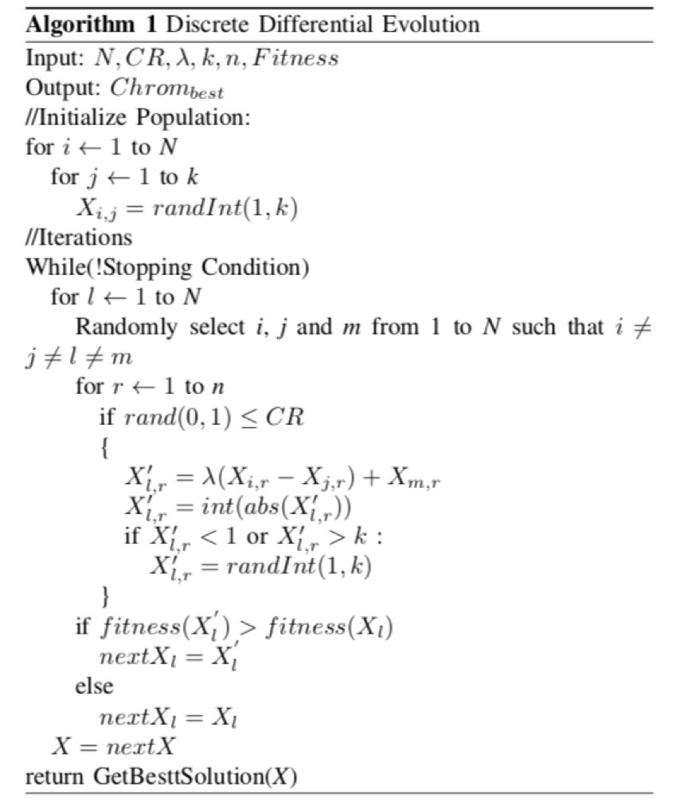
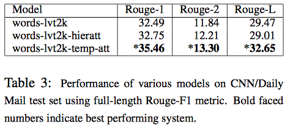
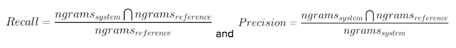

# <span style="color:#1EAAF1">Computational Linguistics</span>
# <span style="color:#1EAAF1">Extractive Text Summarization</span>

Aditya Kashyap, Garvit Gupta, Jialin Wang, Ignacio Arranz, Kashish Gupta and Shiva Suri

25th April, 2018

A more readable Google Docs version of this document can be found at https://docs.google.com/document/d/1S_8wigOa9RhUFnq2uvQJ6bjre7rBkhEJw7ew-KdFEM8/edit?usp=sharing


## <span style="color:#1EAAF1">Table of Contents</span>

1. Title & Authors
- Table of Contents
- Abstract
- Introduction
- Literature Review
- Experimental Design
- Experimental Results
- Conclusion
- Acknowledgements

## <span style="color:#1EAAF1">Abstract</span>

This paper discusses our attempts to achieve a strong ROUGE-2 measure with regards to
extractive text summarization by harnessing several existing methods. Namely, we implemented
and combined atomic event extraction, word frequency, matrix decomposition (i.e. factorization
into canonical form), and finally two different supervised models. We found that achieving an
initial ROUGE-2 score of almost 5% was fairly straightforward (we were able to reach this score
via crudely extracting the first sentence of each article): for a long time, the best performing
extractive summarizers were those which just picked the first ​n​ sentences! However, meliorating
performance proved to be a challenging task given the intrinsic complexity of a summary. While
state-of-the-art ROUGE-2 bigram f-scores for extractive text summarization are roughly 11%, the
highest ROUGE-2 score we obtained was 9.7% and a ROUGE-1 over 32%.


## <span style="color:#1EAAF1">Introduction</span>


### A. Our task

Our task was to find the ​n​ most important sentences in a given paper which contained the most
significant and greatest number of concepts with respect to the rest of the paper. Thus, an initial
objective was to determine a metric that identified concept. After we were able to establish this
baseline, we challenged ourselves to mathematically clean this data (e.g. matrix normalization &
decomposition), and to continually expand upon our definition of a ‘concept’ until we found our
best performing model.

Our model’s inputs were the documents we would like to summarize along with the target
number of sentences. For example, given this text and a target of three sentences, a gold
standard summary produces the following results.


### Figure ​: I/O Extraction Pipeline


### B. Problem Definition

The average human being can read 200 words/minute, limiting how much knowledge they can
consume in any given day. Additionally, when reading an article, paper, blog, etc. it is hard to
determine which parts of the text are important and which parts can be omitted. Using extractive
first (abstractive if we have time) we would like to summarize text for the following use cases:

```
● Text summarization for news articles
● Academic papers
● Group chats
● Legal documents
● Financial statements
```
Of course the use cases get more specialized as the list proceeds, so we would start by creating
a generalized text summarizer and then allowing it to categorize text by field and then summarize
differently for different fields. For example, financial statements all have similar structure, as do
legal documents, so the parser would find common structure between different documents and
summarize them in precified ways. Additionally, we would like to gather features as described
above much further than a generalized use case. For example, we would optically look for bolded
words, words that appear as part of a figure or equation, and words that appear in a title or
subheading.


### C. Motivations

Ultimately, we chose this final project due to its ability to be turned into a product and marketed.
Text summarization seems to have countless applications which can be easily realized (e.g. a
web-application or chrome extension), and we all agreed that our model-turned-tool would be
very useful in our daily lives. Furthermore, while abstractive text summarization seemed
out-of-scope given modern computational linguistics and moreover the inevitable difficulties that
would arise during testing, an extractive approach proved tractable given our growing and
relevant expertise in neuro-linguistic processing (e.g. tf-idf matrix, [cosine] similarity
measurements, name-entity recognition, part-of-speech tagging, paraphrasing, text simplification,
neural nets, etc.).


## <span style="color:#1EAAF1">Literature Review</span>

##### Papers:

1. Text summarization via hidden Markov models - John M Conroy, Dianne P. O'leary
2. Event-Based Extractive Summarization - Elena Filatova, Vasileios Hatzivassiloglou
3. Using Lexical Chains for Text Summarization - Regina Barzilay, Michael Elhadad
4. Extractive Summarization Using Supervised and Semi-supervised Learning - Kam-Fai
    Wong, Mingli Wu, Wenjie Li
5. Single Document Extractive Text Summarization using Genetic Algorithms (2014) - Nilardi
    Chatterji, Amol Mittal, Shubham Goyal


### Text summarization via hidden Markov models
https://www.researchgate.net/publication/224890789_Text_summarization_via_hidden
_Markov_models

The paper presents two new methods:

1. QR Matrix Decomposition
2. Hidden Markov Models

QR Matrix Decomposition
First document summarized by seeking the main ideas:
● SRA’s NameTagTM [Kru95] is used to recognize named entities
● WordNet is used to associate synonyms.

Once the terms are defined, a term-sentence matrix is formed. The job of the
automatic summarization system is to choose a small subset of these vectors to cover
the main ideas (terms) in the document.
The QR Matrix Decomposition iteratively chooses the vector with the largest weight.
Then the weights of the remaining sentences are updated to emphasize ideas not
contained in the first sentence.

1. Parse the document for terms using the Brill tagger [Bri93] (in this approach,
    terms are equivalent to ideas)
2. Create a term-sentence matrix A​:​ if word ​i appears in sentence j​,​ the value of A​ij​
    should be ​ 1 ​. If it doesn’t, it should be ​ 0 ​.
3. Algorithm does as follows (looping):
    * Choose a sentence by measuring the norm (euclidean length) of its column,and choose the one with highest value.
    * Remove that sentence (column) from A
    * Subtract  1  from all the words (rows) from A that belong to the sentence above (this is called decomposition)
    * At each stage of the algorithm, the next sentence that we choose is the one with the largest norm.
4. Create weighting factors of sentences by their position in the document:
    * Nonzeros in column j of matrix Aw are ​(g*exp(-8*j/n)+t)​ times those in A.
    * N is the number of sentences, g and t are parameters TBD.
    * Using a training (development) set of documents, the parameter t is determined so that the function above has a tail approx. the same height as the histogram of the distribution of summary sentences.


```
c. Given t, we determine g and the percent of the document to capture by
maximizing ​F​ 1 ​. ​F​ 1 ​ = 2r/(k​h​ + k​m​)

k​h is the length of the human summary, ​km​ is the length of the
machine generated summary, ​r is the number of sentences they
share in common.
```
Hidden Markov Models
The HMM has two kinds of states, corresponding to summary sentences and
non-summary sentences.

Features are:
* Position of the sentence in the document
* Position of the sentence within its paragraph
* Number of terms in the sentence -> log(number of terms+1)
* How likely the terms are, given a baseline of terms -> log(Pr(terms in i | baseline)
* How likely the terms are, given the document terms -> log(Pr(terms in i |
document)

The model has ​2s+1​ states, with ​s​ summary states and ​s+1​ non-summary states.
The model has 2s​ free parameters (the arrows). The probability of transition between
summary states 2j​ and ​2j+2 is the number of times sentence ​j+1 directly followed
summary sentence ​j​ in the training documents, divided by the number of documents.


The model has three parts:
* p,​ the initial state distribution
* M,​ the markov transition matrix
* B,​ the collection of multi-variant normal distributions associated with each state.

Finally, there are two method for extracting summaries with k sentences. The first one
simply chooses those sentences with the maximum posterior probability of being a
summary sentence. The second uses the QR decomposition described above to
remove redundancies.


### Event-Based Extractive Summarization
[http://www.aclweb.org/anthology/W04-](http://www.aclweb.org/anthology/W04-)

Filatova and Vasileios describe the identification of concepts in the text as an important
step in text summarization and propose a model of concepts based on atomic events.
Atomic events are information about relevant named entities and the relationships
between them--specifically, a pair of named entities connected by a verb or
action-indicating noun. Each atomic event is given a score (importance) based on the
relative frequency of the relation and connector. They compare their event-based
algorithm with an algorithm that uses the (weighted) words that appear in the text
(based on presence in titles, headers, being the first sentence, proximity to words like
important or significant, etc).

Filatova and Vasileios model the extractive summarization problem as breaking the text
into units, extracting the concepts covered by each unit, and choosing the most
minimal units that cover all the most important concepts. They try several methods of
getting the text units, a basic method that gets text units that cover many concepts
(static greedy), and others which try to reduce redundancy in the selected units
(adaptive greedy) or focus on (weigh more highly) units that cover the most important
concepts over the less important ones (modified adaptive greedy). This study used
sentences as text units, atomic events and (tf-idf weighted) words present in text as
features, and ROUGE as their evaluation method. With all three methods of text unit
selection, the atomic event model performed better on ROUGE on more document
sets than the tf-idf weighted model, and both extensions to the model (reducing
redundancy and focusing on most important concepts) performed better than the basic
unit selection method, with the modified greedy adaptive method resulting in
improvements over the static greedy method for both the atomic event and tf-idf
weighted models, but with a much greater improvement for the atomic event model,
with events-based giving a better summary on 70% of document sets for summaries of
100 words, and similar results for 50, 200, and 400 words.


### Using Lexical Chains for Text Summarization
[http://www.aclweb.org/anthology/W97-](http://www.aclweb.org/anthology/W97-)

Introduction:
Summarization is a two-step process:
1) Building from the source text a source representation
2) Summary generation – forming a summary representation from the source
representation built in the first step and synthesizing the output summary text

Summaries can be built from shallow linguistic analysis:
1) Word distribution, most frequent words represent the most important part of the
text
2) Cue phrases. eg. ​In conclusion
3) Location method – heading, sentences in the beginning or the end of the text

Algorithm for Chain Computing:
First computational model for lexical chains was presented in the work of Morris and
Hirst
1. They define lexical cohesion relations in terms of categories, index entries and
pointers in Roget’s Thesaurus.
2. Chains are evaluated by taking a new text word and finding a related chain for it
according to relatedness criteria.
3. DRAWBACK: They did not require the same word to appear with the same sense
in its different occurrences for it to belong to a chain.

Constructing lexical chains follows three steps:
1. Select a set of candidate words
2. For each candidate word, find an appropriate chain relying on relatedness criterion
among members of the chains
3. If it is found, insert the word in the chain and update it accordingly

In the preprocessing step:
1. All the words that appear as a noun entry in WordNet are chosen
2. Relatedness of the words is determined in terms of the distance between their
occurrences and the shape of the path connecting them in the WordNet Thesaurus.
Three kinds of relations are defined:
* Extra strong (Between a word and its repetition)
* Strong (Between two words connected by a WordNet relation)
* Medium Strong (Link between the Synsets of the words is longer than one)

Maximum distance between related words depends on the kind of relation:
* Extra strong: No limit in distance
* Strong relations: limited to a window of seven sentences
* Medium Strong: Within three sentences back

DISADVANTAGE:

This algorithm implements a greedy disambiguation strategy. Disambiguation cannot
be a greedy decision. In order to choose the right sense of the word, the “whole
picture” of chain distribution in the text must be considered

NOVELTY OF ALGORITHM

The current algorithm differs from H&S in the following ways:
· it introduces, in addition to the relatedness criterion for membership to a
chain, a non-greedy disambiguation heuristic to select the appropriate senses
of the chain members
· the criterion for the selection of candidate words
· the operative definition of the text unit
Candidate words chosen: simple nouns and noun compounds

Building Summaries Using Lexical Chains:
· ​ The most prevalent discourse topic will play an important role in the summary.
· Picking concepts represented by strong lexical chains gives a better indication of
central topic of a text than simply picking the most frequent words in the text.
The following parameters were found to be good predictors of the strength of the
chain:
1) Length: The number of occurrences of members in the chain
2) Homogeneity index: 1 – the number of distinct occurrences divided by the length
Score(Chain) = Length*Homogeneity


### Extractive Summarization Using Supervised and Semi-Supervised Learning
[http://anthology.aclweb.org/C/C08/C08-1124.pdf](http://anthology.aclweb.org/C/C08/C08-1124.pdf)

1. With the notion that every sentence feature has its unique contribution, the
    paper investigates combined sentence features for extractive summarization.
2. Investigates the effectiveness of different sentence features with supervised
    learning to decide which sentences are important for summarization.
3. The sentences are ranked, and top ones are extracted to compile the final
    summaries.
4. Builds on top of previous work:
    a. Position and length are useful surface features. (due to Radev et al. (2004))
    b. Centroid (due to Radev et al., 2004)
    c. Signature terms (due to Lin and Hovy, 2000)
    d. High frequency words (due to Nenkova et al., 2006).
5. Framework:
    a. Rank​i​= RankPos​i​ + RankLength​i
    b. Where RankPos​i​is the rank of sentence i according to its position in a document (i.e. the sentence no.) and RankLength​i​ is rank of sentence i according to its length.
6. Sentence Features for Extractive Summarization
    a. Surface Features: Based on structure of documents or sentences, including sentence position in the document, the number of words in the sentence, and the number of quoted words in the sentence.
    b. Content Features: Integrated three well-known sentence features based on content-bearing words i.e., centroid words, signature terms, and high frequency words.
    c. Event Features: An event is comprised of an event term and associated event elements.
    d. Relevance features: Incorporated to exploit inter-sentence relationships. It is assumed that: (1) sentences related to important sentences are important; (2) sentences related to many other sentences are important. The first sentence in a document or a paragraph is important, and other sentences in a document are compared with the leading ones.
7. Models used:
    a. Probabilistic Support Vector Machine (PSVM)
    b. Naïve Bayesian Classifier (NBC)


### Single Document Extractive Text Summarization using Genetic Algorithms
Discrete Differential Evolution for Text Summarization
https://www.researchgate.net/publication/260741276_Single_document_extractive_tex
t_summarization_using_Genetic_Algorithms

The paper proposes that by clustering sentences which contain similar pieces of
information together, we can subsequently extract strong summaries by aggregating
the most important sentence from each cluster. The authors also highlight that a
common problem with k-means clustering is convergence to local minima (rather than
global), and hence suggest the use of “evolutionary” (i.e. genetic) algorithms for
clustering.

The quality of a partitional clustering algorithm is determined by the similarity measure
used and the optimization criterion (fitness) function chosen to reflect the underlying
definition of the quality of clusters. The authors propose to use cosine similarity
measure and a fitness function they developed for the sole purpose of extractive text
summarization. The paper outlines 5 decisions necessary to make in order to achieve
the summary via this method:
1) Represent document in mathematical (vector) form
2) Define similarity metric between two documents
3) Determine the criteria fitness function
4) Cluster on the basis of this fitness function
5) Select important sentences from each cluster to include in the summary

The algorithm discusses the evolutionary algorithm which involves the following
pseudocode, where ​N​ is the number of sentences in the summary, ​CR​ is the cross-over
rate, λ is a scalar multiplier, and ​k​ is the number of clusters.



Each chromosome is represented by , which is a vector of sentences from each cluster
forming a possible cluster. ‘Discrete’ differential evolution allows chromosomes to
contain integer values and hence simplifies the computations. Using a tf-idf matrix, a
weight is assigned to each word in a sentence, and a vector of weights hence forms a
sentences. We can compare two sentences similarities by computing the cosine
similarity measure between the two vectors. Furthermore, the fitness function proposed
optimizes for compactness (every sentence in a cluster is similar to one another) and
separability (clusters are distinct).

Ultimately, we chose not to proceed initially with this method for extractive text
summarization due to the genetic unreliability of genetic algorithms, which have a
tendency to ‘work’ eventually after endless grid-searching without a clear explanation.
Furthermore, there is too much randomness with the proposed algorithm, which would
unnecessarily complicate testing and make it difficult to achieve a consistently strong
summarization.


Implementation:

We chose to implement the atomic event-based published baseline because we found
that three of the papers we read (event-based, QR matrix decomposition, and
supervised+semi-supervised) all had a similar method of extracting events (or terms)
and choosing sentences based on how many events they covered. The event-based
baseline (with the static greedy algorithm) was ultimately the simplest and most
straightforward to implement; the supervised+semi-supervised baseline combined
events and three other types of features and QR matrix decomposition involved
mapping to wordnet senses and an algorithm that required graphing a histogram. We
will consider features from these papers as extension ideas for future milestones.


## <span style="color:#1EAAF1">Experimental Design</span>

### A. Data

Our test data comprised of a conglomeration of CNN articles; namely, we used over 93,000 CNN
articles and roughly 208,000 Daily Mail articles, which had gold text summaries we could use to
evaluate our summaries
(​https://machinelearningmastery.com/prepare-news-articles-text-summarization/​ helped us
prepare the document dataset for text summarization). 80% (about 74k cnn articles and 168k daily
mail articles) of the data is used for training, and 10% (9k cnn and 20k daily mail) is used for each
of development and testing. There are two versions of the training and development data, one
with the text and summary, and one with only the gold summary for evaluation. The test data has
three versions, there is one with only the text so the gold summaries are not revealed.

Since we began with an unsupervised approach to text summarization, we did not have a training
model per se in the simple and published baselines, but in later extensions that achieved the
best [ROUGE-2] scores, we adopted a supervised model that explicitly trained on the data.

Each data set is in a .txt file. Each line of the file contains the text of one article and its highlights
(summary), tab-separated (article, \t, highlights). Leading "(CNN)--" (but not necessarily other intro
tags, like reuters or cnn student news) and excess whitespace have been removed, but the text
retains its original capitalization, punctuation, etc. to allow for these features to be used in
summarizer extension implementations.

The data is from the deepmind q&a dataset (https://cs.nyu.edu/~kcho/DMQA/), which used
articles from cnn and the daily mail to research q&a. Preprocessed data from
https://github.com/JafferWilson/Process-Data-of-CNN-DailyMail was also available; this data
produced all-lowercase .bin files that had similar cleaning and tokenization. We elected not to
use these files because we may want to use some of those removed features to train/extend our
summarizer.

The complete data set/files needed to run simple-baseline.py and score.py can be found at
https://drive.google.com/file/d/1I00XpcAUCbEgqpmR13Sp8_UcnOXzlQjP/view?usp=sharing

**Table** ​: Dataset details

<table>
  <tr>
    <td>Data</td>
    <td>Size</td>
    <td>Description</td>
  </tr>
  <tr>
    <td>CNN News Articles</td>
    <td>93K articles and corresponding summaries, 151 MB of training data.</td>
    <td>The articles have an average of 718 words each (calculated with sample of the first 5000, given the size of the dataset).
The summaries had an average length of 45 words, in the majority of cases of 3 sentences.</td>
  </tr>
  <tr>
    <td>Daily Mail</td>
    <td>149K articles and 809 MB of training data.</td>
    <td></td>
  </tr>
</table>

As shown in the image below from the following paper (​https://arxiv.org/pdf/1602.06023.pdf​) this
dataset was used in a very recent paper that used RNNs to produce abstractive text
summarization and obtained the following metrics for Rouge-1 and Rouge-2.



Another paper to use this has been a recent one
(​https://machinelearningmastery.com/prepare-news-articles-text-summarization/​) which has risen
the state of the art Rouge-2 to 17%, generating a 2 point improvement on other recent solutions.

An example of an article and its summary are shown in the image below.


### B. Evaluation Metric

To gauge our extracted summaries against the gold standard ones, we decided to use ROUGE
(Recall-Oriented Understudy for Gisting Evaluation) measures, which is a set of metrics that apply
to automatic text summarization and machine translation.

ROUGE measures are intended to score the produced summary against a (gold standard)
man-made reference summary, where the recall is computed as Number of Overlapping Words / Total Words in Reference Summary and precision is Number of Overlapping Words / Total Words in System Summary. This paper (http://www.aclweb.org/anthology/W04-1013​ )​

describes clearly the advantages and disadvantages of Rouge, within all its variations.

ROUGE-1 and ROUGE-2 measure overlapping unigrams and bigrams, respectively, across (our
programmed) system summary and reference summary.

The image shows how Rouge-2 does not have such a strong Pearson correlation with human vs
human judgements, for short summary tasks (i.e. headlines), where Rouge-1 is usually better.

 

We tested the success of our model via ROUGE unigram and bigram scores as the overwhelming
majority of relevant research suggests. Specifically, we calculated recall and precision using the
following equations:



With extractive methods, the summary against which we would evaluate would very likely have
different words, limiting the value for the ROUGE recall; for instance, if the reference were to have
15% of words not in the original text, then the maximum possible value for the recall is 85%. We
calculated our total ROUGE-2 score by computing the average across all ROUGE-2 measures
(one per summary-document pair). From the very beginning, our main objective was to achieve a
noteworthy ROUGE-2 score near the state-of-the-art 11%, and we came pretty close to this
number with our best performing model achieving a solid 9.7%. Note that our ROUGE-2 is
innately limited by the fact that labels are not extractive, known features of the data, as the
intersection of n-grams is never going to be 100%. We computed the maximum possible
ROUGE-2 score to be 22.9%, on average, with a high variation depending on the text (see details
at end of this document on this).

### C. Simple Baseline

For our simple baseline, we chose the first sentence of each article to be the only sentence
included in the summary. Another option was to choose a random sentence from the article;
however, it proved much more logical to select the first sentence/headliner, as it is often the most
important one in a given article. This method yielded an average ROUGE-2 f-score of 4.9% and
ROUGE-1 of 21.2%.


## <span style="color:#1EAAF1">Experimental Results</span>


### A. Published Baseline

For the published baseline, we chose to execute the second paper described in the literature
review (​Event-Based Extractive Summarization​ - Elena Filatova, Vasileios Hatzivassiloglou) found
at ​http://www.aclweb.org/anthology/W04-1017​. The baseline incorporates the idea of tying
concepts to phrases described in the introduction by identifying ​atomic events ​within sentences.
An atomic event in a sentence is defined as a named entity pair split by a ​connector​. For
example, in the sentence “David Beckham is headed for the Hollywood Hills,” David Beckham
and Hollywood Hills are two entities joined by the connector “​is​ headed for the”. The sentence
between the entities is a connector if it has a verb or an action noun. In this case “is” is the verb.

The algorithm also included the top ten most frequent nouns in an article along with the named
entities, as it is common that a story will not be solely based on entities but also provide
information about certain nouns (in the case of an airline crash, the airline would be an entity,
whereas passengers and crew will likely be among top 10 nouns). The connectors required
either a verb or an action noun – which is any hyponym of “activity” and/or “event”.

We used spaCy (https://spacy.io/api/span) for named entity recognition and part-of-speech
tagging, and we imported Selenium to scrape hyponyms [see hyponym_scraper.py] of ‘activity’
and ‘event’ off the web to find action nouns. Essentially, our implementation had the following
steps:

```
1) Split the article into sentences
```
We used spaCy’s sentence parser.

```
2) Count the number of atomic events in each sentence
```
We only considered entity pairs – which had to be subsequent entities – in the same sentence.

```
3) Obtain a weight for each atomic event
```
We created a sentence-atomic event matrix ​ **Aij** ​, with 1s and 0s and then a vector ​ **v** ​ with the
weights for each entity pair j: v_j = n_j / (∑_j n_j). Lastly, we made a matrix **Wjk** ​ with the weight of each​ connector, for every entity pair: W_jk = n_j,k / (∑_k n_j,k)

```
4) Add the sum of atomic events for each sentence to get a score
```

```
5) Rank the sentences by descending score and choose the top 3, since the gold summaries
had three sentences each.
6) Sort them by the order in which they appeared for fluidity.
```
On the test set, when evaluating with bigrams we obtained the following ROUGE-2 measures:


### Published Baseline vs. Simple Baseline

Precision: 0.058 0.072

Recall: 0.126 0.038

FScore: 0.079 0.049

And when evaluating with unigrams, we obtained the following ROUGE-1 measures:


### Published Baseline vs. Simple Baseline

Precision: 0.253 0.305

Recall: 0.561 0.163

FScore: 0.349 0.212

The image below shows the result for atomic events in the paper, using Rouge-1. The paper
provides a good warning about Rouge, stating that “ROUGE scores are difficult to interpret as
they are not absolute and not comparable across source document sets”. For extractive methods,
the Rouge score will depend on how similar the summary is to the original sentences.


Our Rouge f-score of 0.349 seems to be in line with the top results obtained for Rouge across the
different documents used in the referenced paper.

As mentioned, results are not directly comparable because the paper used the document sets
used in the evaluation of multidocument summarization during the first Document Understanding
Conference (DUC), organized by NIST (Harman and Marcu, 2001). We had chosen our dataset
prior to the baseline method, reason for which the datasets are not the same. As mentioned, for
this reason, the results are not directly comparable.

### B. Extensions

We implemented four extensions to the published baseline: word frequency, matrix
decomposition (i.e. factorization into canonical form), and two different supervised models.

### i. Word Frequency extension

We implemented an extension to our milestone that used the same principle that sentences that
covered more concepts would be more important. However, instead of whether a sentence
contains atomic events, this extension considers the frequency of words that appear in the
article.

The model first finds all the non-stop words (stop words being common but essentially
meaningless words like "the" or "and") and gives them a weight based on their relative frequency
in the article text.

Next, the model will give each sentence a weight based on the sum of the weights of each
non-stop word that appears in the article. The top N sentences are selected to be the summary.
We tested this extension with N = 3.


This extension is based on the model implemented in the QR decomposition/Hidden Markov
paper. We felt that a word-frequency based model might show improvement compared to an
atomic-event based model because:

```
1) It is possible that important objects/agents in the article are not named entities (although
top 10 nouns being added to the named entities handles this to a certain extent, lower
frequency nouns could still be important)
2) Important entities in the article will not necessarily be part of an atomic event. For
example, "At the hospital at 10:30 AM, Mary died." This is likely an important sentence that
gets at the main idea of an article without extraneous information, but there is no chance
it can be selected in the baseline because it does not contain any atomic events.
```
This extension also could be a possible tool/feature that turns our unsupervised model into a
supervised model.

On ROUGE-2:

```
Baseline vs. Word-Freq. Extension
```
Precision: 0.126 0.051

Recall: 0.038 0.126

F-score: 0.079 0.072

On ROUGE-1:

```
Baseline vs. Word-Freq. Extension
```
Precision: 0.253 0.236

Recall: 0.561 0.601

F-score: 0.349 0.339

Although this extension overall performed worse on the f-score and precision, with less than half
the bigram precision of the baseline, the f-scores remained close and we saw near-quadrupling
of the bigram recall and a smaller increase on the unigram recall. This suggests that combining
the two methods, perhaps using weightings chosen by a supervised classifier, would be effective
in improving the overall score. One explanation for the higher-recall, lower-precision might be


that the model is biased towards longer sentences, since they are likely to contain more
concepts. This is a problem that our baseline also shows, although it seems more pronounced in
this implementation. This suggests that implementing a method of normalizing sentence weights
by sentence length could be effective.

### ii. QR Matrix Decomposition

The second extension consisted of doing QR decomposition, including a small modification to
also normalize by sentence length. For the latter, we simply divided the weight of every sentence
(after atomic event weights were totalled) by its length in words. This was motivated by a desire
to reduce the bias towards long sentences, which were more likely to contain a large number of
atomic events, but which could also have unnecessary information that reduced our precision.
For the latter modification, we took the steps described in the introductory section, for the first
reviewed paper which had a section on QR Decomposition. QR decomposition is a process by
which, following the selection of one of the most highly weighted sentence, as in the published
baseline, the atomic events found in that sentence are removed from the weighting schema. This
method seeks to reduce redundancy in the predicted sentences. Without it, if the first sentence
chosen contains 5 atomic events, and two options for the second sentence contain 4 and 3
respectively, the algorithm will most likely choose the former for the second extracted summary,
even if 3 out of the 4 are the same atomic events as those in the already-extracted sentence and
the latter contained only new information. As predicted, this extension did indeed show
improvement over the published baseline implementation in ROUGE-2. This improvement
primarily the result of the addition of the QR decomposition; the normalization by length
produced only a small (~0.002) improvement in the f-score.

The QR-matrix decomposition showed an improvement in recall by about threefold, although the
precision was approximately halved. The recall improvement was most likely the result of
originally outweighted atomic events being expressed in the new chosen sentences. The
decrease in precision is more difficult to explain, but it could be that the originally low-ranked
sentences (before decomposition) were lower-ranked because they were longer respective to
their atomic weight sums, or perhaps some factor relating to the much greater importance of
some atomic events over others that is not taken into account by our model. The latter seems to
be motivated by a section in our original paper, which discusses their own modification that tries
to apply additional methods to extract the most important atomic events first. The ROUGE-1 score,
on the other hand, decreased in every section except precision. This may be because in the
original published baseline, multiple sentences focusing on the same atomic event were chosen,
so the specific words used in the gold summary to describe those events were more likely to be
used, while entirely new ideas are prioritized in this extension.

ROUGE-2:

```
Baseline vs. QR Matrix Decomposition Extension
```
Precision: 0.126 0.0693

Recall: 0.038 0.1113

F-score: 0.079 0.0855

ROUGE-1:

```
Baseline vs. QR Matrix Decomposition Extension
```
Precision: 0.253 0.2647

Recall: 0.561 0.4207

F-score: 0.349 0.3249

### iii. Supervised Learning Extension

This extension followed the paper from Literature Review #4
(​http://anthology.aclweb.org/C/C08/C08-1124.pdf​), which proposes a learning-based approach to
combine sentence features: namely, surface, content, and relevance features as described in the
Literature Review section.

The following figure illustrates the model’s pipeline as it feeds sentences and features into a
classification model to ultimately rank sentences and produce a summary. We felt that a
supervised model would be effective in generating summaries because of our large data set, and
a supervised model’s ability to iteratively find the best relative weightings of each feature.


We used SVM with a Gausian Kernel as the classifier, and the specific features we trained are as
follows:

1. Centroid Bigram: The sum of the weights of centroid bi-grams
2. Centroid Unigram: The sum of the weights of centroid unigram
3. Event Features
4. First Relative of Document: Similarity with the first sentence in the document
5. Frequency of Word Bigram: The sum of the weights of frequent bigrams
6. Frequency of Word Unigram: The sum of the weights of frequent unigrams
7. Label
8. Signature Bigrams: The number of signature bigrams
9. Signature Unigrams: The number of signature unigrams
10. Document first: Whether it is the first sentence of a document
11. Entity score
12. Length: The number of words in a sentence
13. Position in sentence
14. Quote: The number of quoted words in a sentence

To turn this into a supervised model, we ran an algorithm that found, for each article, the 3
sentences that maximized Rouge-2. Those three sentences were labeled as 1, and the rest as 0,
creating thus the y-train labels.


Wong et al. were able to achieve a ROUGE-2 of 0.082 and ROUGE-1 of 0.358 with SVM as the
learning approach and a ROUGE-2 of 0.090 and ROUGE-1 of 0.366 with COT. Our results did not
quite match up to theirs in this extension. They are however not comparable, as theirs was run
with different data. The value of the extension helps us understand that for this dataset, this
supervised algorithm with several features extracted for the text, is not superior to the atomic
events. It makes us think that a combination of the two may be potentially superior (as will be
shown on the last extension). Potential reasons for the much-decreased performance on rouge-2
may involve the non-extractive nature of the human-generated gold labels or a dissimilarity in
how different articles are written that impacts the ability of the model to judge which factor is
most important.

ROUGE-2:

```
Baseline vs. SVM Extension
```
Precision: 0.126 0.0365

Recall: 0.038 0.0642

F-score: 0.079 0.0465

ROUGE-1:

```
Baseline vs. SVM Extension
```
Precision: 0.209 0.2090

Recall: 0.382 0.3817

F-score: 0.27 0.2701

**Figure:** ​Wong et al. results with all three models


### iv. Supervised learning + atomic events + sentence limit

This extension took all the features in extension (iii), and incorporated another feature that
processed the scores of atomic events for each sentence. We turned the highest three into a 1,
and the remaining scores into 0s (essentially equivalent to using the output of the former model
as an input feature).

We trained the model using the same y-train labels described above.

Instead of using SVM in this extension, we produced superior results with AdaBoost, and instead
of predicting a label, we predicted the probability of the label being a 1. We then queried the
three sentences with the highest probability and labelled those as 1 and the rest as 0.

This produced a really solid f-score with ROUGE-2 of 9.7%, which beat the baseline. It seems that
the content of the summary (atomic events) is a more important factor in determining goodness
than just observable rules.

The implementation of this extension can be found in baseline_extension_3.py, and score.py can
be run to see the results.

ROUGE-2:

```
Baseline vs. AdaBoost, Atomic Event, Sentence Limit Extension
```
Precision: 0.126 0.0805

Recall: 0.038 0.1234

F-score: 0.079 0.0974

ROUGE-1:

```
Baseline vs. AdaBoost, Atomic Event, Sentence Limit Extension
```
Precision: 0.209 0.2893

Recall: 0.382 0.4365

F-score: 0.27 0.3480


### v. Table of Results

**Model**|**Simple Baseline**| |**Published Baseline**| |**Word Frequency**| |**QR Matrix Decomposition**| |**SVM Supervised**| |**AdaBoost, Atomic Event, Sentence Limit**| 
:-----:|:-----:|:-----:|:-----:|:-----:|:-----:|:-----:|:-----:|:-----:|:-----:|:-----:|:-----:|:-----:
ROUGE|R-1|R-2|R-1|R-2|R-1|R-2|R-1|R-2|R-1|R-2|R-1|R-2
Precision|0.305|0.072|0.253|0.126|0.236|0.051|0.2647|0.0693|0.209|0.0365|0.2893|0.0805
Recall|0.163|0.038|0.561|0.038|0.601|0.126|0.4207|0.1113|0.3817|0.0642|0.4365|0.1234
F-Score|0.212|0.049|0.349|0.079|0.339|0.072|0.3249|0.0855|0.2701|0.0465|0.348|0.0974


### C. Error Analysis

What is interesting about text summarization, is that a great part of the qualitative analysis will be
placed on whether the summary is humanly readable and contains sufficient information. We
have taken care of it being concise by limiting its size.

A few interesting examples:
* Example 1:
```
Original summary:
San Antonio, Texas, 12-year-old wins "Doodle for Google" national contest Christin
Engelberth's work will grace Google's main site for 24 hours Thursday Other
prizes: $25,000 college scholarship, laptop, tech grant for her school When she
grows up, she said, she hopes to do "anything to do with art".

Automatic Summary:
One of the perks of using search engine Google's home page is checking out the
frequently changing seasonal, current-event, and holiday-inspired "doodles" used
for the logo.Christin Engelberth's "doodle" beat out more than 28,000 entries in
Google's annual contest.All winners were treated to a day in New York that
Google said "included activities which promote peace, sustainability and wellness
-- all inspired by this year's theme."
```

* Example 2:


```
Original Summary:
Son of Sen. John McCain, the former GOP presidential candidate, graduates Jack
McCain shakes hands with Obama, who delivers commencement address He is
the fourth McCain to graduate from Naval Academy Obama vows to not send
them to war unless it is "absolutely necessary"

Automatic Summary:
President Obama delivered the commencement address Friday to the U.S. Naval
Academy's graduating class, speaking to an audience of 30,000 that included a
former presidential candidate and proud parent of one of the graduates in
attendance. Jack McCain shakes hands with President Obama at Friday's
commencement ceremony." Obama also promised additional assistance to
military families, vowing that "we will be with you every step of the way, increasing
your pay, increasing child care and helping families deal with the stress and
separation of war."
```
Both of these examples generated by our best model are surprisingly good. What seems evident
is that the sentences are generally very long. Some of our error could be caused by a
combination of this and the inability to perfectly extract sentences equivalent to the goldfile when
the articles do not always contain the words and phrases contained in the gold summaries
word-for-word, even if the right ideas are represented in both. This suggests a potential issue
with ROUGE as a metric in itself--perhaps a system that took into account semantic similarity
would be more suited to the problem, even though ROUGE is a more-commonly used metric in
the current literature.


## <span style="color:#1EAAF1">Conclusion</span>

The state of the art has been found to be 17%, but this is the case of abstractive summarization
methods, with the same data that we utilized. Of the literature reviewed, we found that the
best-performing methods extractive methods close to 11%.

Understandably, it is difficult to reach high values of ROUGE-2 with extractive methods. We
created a greedy algorithm to find the 3 sentences that would generate the best ROUGE-2
against the summaries. The average ROUGE-2 for a sample of 1000 of those summaries was
22.9% f-score. This is immediately the maximum possible value that can be obtained and sets a
threshold. We believe that such a metric should be “mandatory” on any paper proposing an
extractive summarization method, as it sets a good reference - the direct opposite of the random
baseline.

The image below shows the distribution of the maximum possible ROUGE-2 score. The
interesting thing is the variation, showing that summaries vary in their use of original words.


Our best prediction, however, was 9.7% Rouge-2, not far from the best extractive methods. We
are pleased to have realized our motivations behind the project and are confident that we could
commercialize our model into a useful tool for text summarization.


## <span style="color:#1EAAF1">Acknowledgements</span>

We would like to thank Reno, who was our TA and provided numerous insights into how and
what would be best to implement and excellent guidance throughout our project. Other important
resources we used were the NLP tools from spaCy and the dataset from the Deepmind Q&A
project. Finally, we would also like to thank Professor Chris Callison-Burch and all the TAs for
teaching this class.


